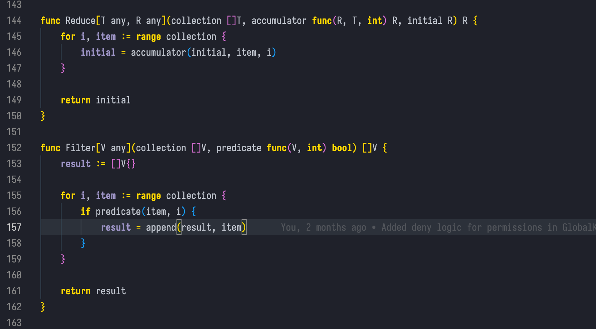

# Gruber Dark #

A slightly modified version of [Gruber Darker](https://daringfireball.net/projects/bbcolors/schemes/Gruber%20Dark.bbcolors)
color theme for Emacs by Jason Blevins, ported to vscode and added support for more languages

# Screenshot #

Golang

Javscript/Typescript
